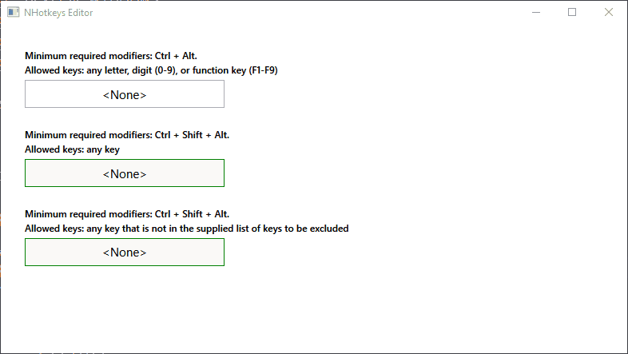

# NHotkeys Editor

NHotkeys Editor is a customizable shortcut editor control for **WPF**. It allows the user to enter a combination of keys that can be later associated with an action to be performed within a WPF application.

This control does not support the `Win` modifier key.

## Demo



## Modifier Keys

To specify the modifier key(s) that are required to be included in a shortcut, you can assign one of the following values to the `MinRequiredModifiers` property:

- `CtrlShiftAlt` : Requires the Ctrl, Shift, and Alt keys.
- `CtrlAlt` : Requires the Ctrl and Alt keys
- `CtrlShift` : Requires the Ctrl and Shift.

## Controlling The Allowed Keys

The range of expected keys to be included in the combination of keys can be controlled using the `RangeOfAllowedKeys` property. One of the following values must be specified:

- `AllKeys` : All keys are allowed.
- `LettersDigitsFunctions`: Only letters, digits, and function keys (F1-F12) are allowed.

### Keys to Be Excluded

A list of keys to be excluded can be supplied to the control. Use the `ExcludedKeys` property to bind a list of keys as shown in the example below.  

## Usage

Add the following to your .xaml file.

```xml
<window
    xmlns:fb="clr-namespace:NHotkeysEditor.Controls;assembly=NHotkeysEditor">
    
    <fb:HotKeySelector
        Width="250"
        Height="35"
        HorizontalAlignment="Left"
        HorizontalContentAlignment="Center"
        VerticalContentAlignment="Center"    
        BorderThickness="1"
        CaretBrush="Red"
        ExcludedKeys="{Binding ExcludedKeys}"
        FontSize="15"    
        IsReadOnly="True"
        IsReadOnlyCaretVisible="True"
        IsUndoEnabled="False"
        MinRequiredModifiers="CtrlShiftAlt"
        RangeOfAllowedKeys="All" />
</window>    
```

## Behaviors

- Pressing `escape` resets the control.
  